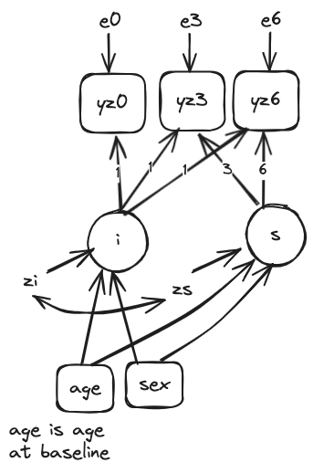
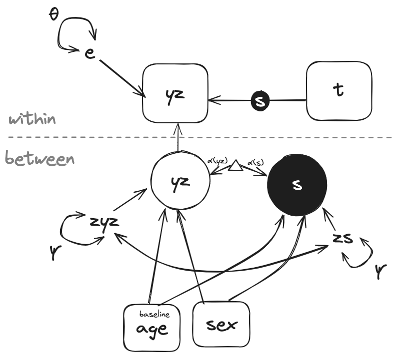
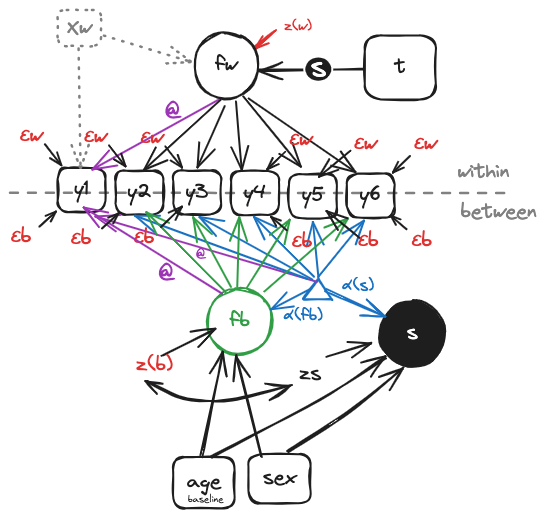
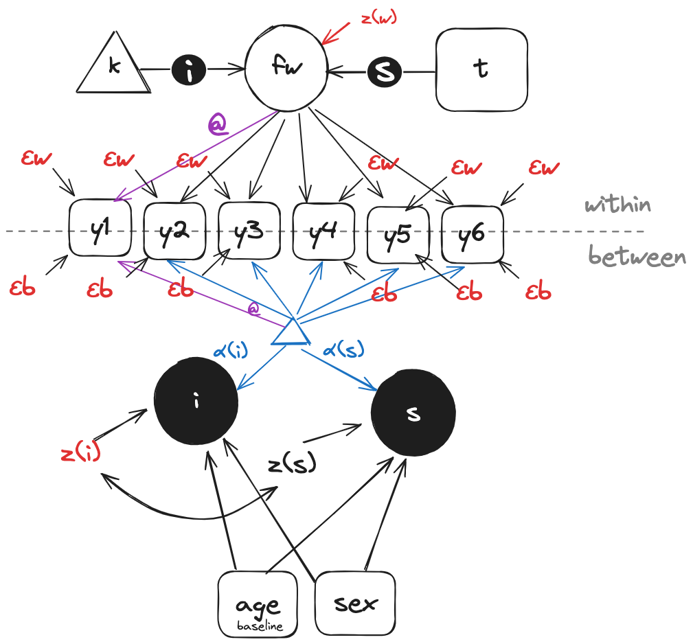
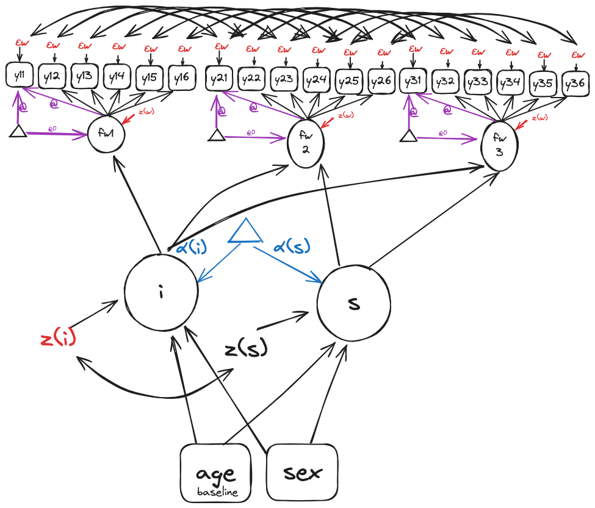

## Multilevel Curve of Factors

Sometimes there is too much longitudinal data to keep the data "wide". Growth can be modeled more easily if we use a "long" data framework and a multilevel approach to growth. 

But how to specify the model?

::: {style="font-size:0.6em;"}
Note: This presentation treats factor indicators as continuous indicators.
:::


---

::: columns
::: {.column width="50%"}
{height="50%"}
:::

::: {.column width="50%"}
::: {style="font-size:0.7em;"}
I will work through an example using CESD responses collected from the New Haven Site of the EPESE (Established Populations for the Epidemiologic Study of the Elderly) study. The four-category responses of six CESD questions will be treated as continuous indicators of a common underlying trait.

These data are public and can be obtained from ICPSR.
:::
:::
:::


<!-- Print the resulting html with pagedown::chrome_print -->
<!-- pagedown::chrome_print("Penalized-DIF-Multiple-Groups.html") -->
<!-- This won't allow for scrollable fields tho. -->

<!-- Mplus engine -->

<!-- Users may need to replace "/Applications/Mplus/mplus" with the -->

<!-- path to their own Mplus executable -->

```{r}
#| label: MplusEngine
#| echo: false
#| output: false
knitr::knit_engines$set(mplus = function(options) {
    code <- paste(options$code, collapse = "\n")
    fileConn<-file("formplus.inp")
    writeLines(code, fileConn)
    close(fileConn)
    out  <- system2("/Applications/Mplus/mplus", "formplus.inp")
    fileConnOutput <- file("formplus.out")
    mplusOutput <- readLines(fileConnOutput)
    knitr::engine_output(options, code, mplusOutput)
})
```

<!-- The QMD inserts copies of INP files, but I want to make sure those files exist -->

<!-- before I run the QMD the first time. -->

```{r}
#| label: messup
#| echo: false
#| output: false
file_names <- c("401-model1.inp", 
                "401-model2.inp", 
                "401-model3.inp" ,
                "401-prelim1.inp", 
                "401-prelim2.inp",
                "401-prelim3.inp",
                "401-mlfa.inp",
                "401-mlgof.inp",
                "401-milgcm.inp")

# Loop over each file name
for (file_name in file_names) {
  # Check if the file exists
  if (!file.exists(file_name)) {
    # File does not exist, create the file and write "rerun QMD" on the first line
    writeLines("rerun QMD", file_name)
  }
  # If the file exists, do nothing and move to the next file name
}
```

<!-- showme function -->

<!-- I use the showme function to display INP files -->

```{r}
#| label: showmefunction
#| echo: false
#| output: false
showme <- function(x) {
   # Replace 'path/to/your/file.txt' with the path to your text file
   file_path <- x
   # Read the contents of the file
   file_contents <- readLines(file_path)
   # Print the contents to the console
   cat(file_contents, sep = "\n")
}
# showme("/Users/rnj/Library/CloudStorage/Dropbox/My Mac (BMH2C02DM1TSMD6T)/Downloads/genmem_metric.out")
```


<!-- readSvalues function thanks ChatGPT -->
```{r}
#| label: readSvaluesfunction
#| echo: false 
#| output: false 
readSvalues <- function(filename) {
  # Read the file lines into a vector
  lines <- readLines(filename)
  
  # Initialize an empty vector to store the lines of interest
  lines_of_interest <- character(0)
  
  # Flag to keep track of whether the starting line has been found
  found_start <- FALSE
  # Counter for blank lines
  blank_line_count <- 0
  
  # Loop through each line in the file
  for (line in lines) {
    # Check for the starting line
    if (grepl("MODEL COMMAND WITH FINAL ESTIMATES USED AS STARTING VALUES", line)) {
      found_start <- TRUE
      next
    }
    
    # If the starting line has been found, process the lines until 3 blank lines are encountered
    if (found_start) {
      if (nchar(trimws(line)) == 0) { # Check for a blank line
        blank_line_count <- blank_line_count + 1
        if (blank_line_count == 3) {
          break
        }
      } else {
        blank_line_count <- 0 # Reset blank line counter if a non-blank line is found
        lines_of_interest <- c(lines_of_interest, line) # Add the line to the vector
      }
    }
  }
  
  # Remove blank lines from the lines of interest
  lines_of_interest <- lines_of_interest[nchar(trimws(lines_of_interest)) > 0]
  
  # Return the character vector
  return(lines_of_interest)
}

# Use the function to read the file and save the output
# svalues <- readSvalues("prelim2.out")
```


<!-- Libraries -->

<!-- Here are libraries that important for compiling the -->

<!-- QMD, but are not part of the didactic content -->

```{r}
#| label: QMDlibraries
#| echo: false
#| output: false 
#| warning: false 
#| message: false
library(kableExtra)
library(ggplot2)
library(dplyr)
library(purrr)
library(haven)
library(stringr)
```

```{r}
#| label: prepare data
#| echo: false 
#| output: true 
#| warning: false
# Get depression items from three waves of New Haven EPESE
y0 <- here::here("Data", "baseline_120905.dta")
y3 <- here::here("Data", "follow-up_3_121205.dta")
y6 <- here::here("Data", "follow-up_6_121205.dta")

# List of suffixes (0, 3, 6)
suffixes <- c(0, 3, 6)

# Loop over the suffixes
for (suffix in suffixes) {
  # Construct the path variable name and dataframe name
  path_var_name <- paste0("y", suffix)
  df_name <- paste0("dfy", suffix)
  # Get the path from the variable name
  file_path <- get(path_var_name)
  # Read the Stata file and assign to the new dataframe
  assign(df_name, haven::read_dta(file_path) %>% filter(site == 3))
}

# demographics only in baseline file
dfdemo <-  dfy0 %>% select(id, sex, age) 

dfy0 <-  dfy0 %>%
    select(id, nh_sad, nh_blues, nh_depressed, 
           nh_happy, nh_enjoyed, nh_hopeful) %>% 
    mutate(t=0) %>%  # time in years
    mutate(td=0/10) # time in decades

dfy3 <-  dfy3 %>%
    select(id, nh_sad, nh_blues, nh_depressed, 
           nh_happy, nh_enjoyed, nh_hopeful) %>% 
   mutate(t=3) %>%  # time in years
   mutate(td=3/10) # time in decades

dfy6 <-  dfy6 %>%
    select(id, nh_sad, nh_blues, nh_depressed, 
           nh_happy, nh_enjoyed, nh_hopeful) %>% 
   mutate(t=6) %>%  # time in years
   mutate(td=6/10)

df <- rbind(dfy0,dfy3,dfy6)

df <- df %>%
  rename_at(vars(starts_with("nh_")), ~str_replace(., "nh_", "")) %>% 
  rename(depress = depressed, enjoy = enjoyed)

# Missing values
variables <- c("sad", "blues", "depress", "happy", "enjoy", "hopeful")

# Loop through each variable and recode 8 and 9 to NA
for (var in variables) {
  df[[var]][df[[var]] == 8] <- NA
  df[[var]][df[[var]] == 9] <- NA
}

# Add in sex and age
df <- df %>% left_join(dfdemo, by = "id")

# Limit to non-missing depression items. 
df <- df %>%
   filter(if_any(c(sad, blues, depress, 
                   happy, enjoy, hopeful), ~ !is.na(.)))

# compute the sum score and standardize it
df <- df %>%
  mutate(ymean = rowMeans(select(., sad, blues, depress, happy, enjoy, hopeful), na.rm = TRUE))
ymean0 <-  mean(df$ymean[df$t == 0], na.rm = TRUE)
ysd0 <-  sd(df$ymean[df$t == 0], na.rm = TRUE)
df <- df %>%  mutate(yz = (ymean - ymean0) / ysd0) 

# Create agec70. Age in EPESE public use data is provided in 
# categories. I will recode into agec70 (age centered at 70)
# and expressed in decades (not years) as follows:
#  age  Label  agec70
#  1    <70    -0.3
#  2    70-74   0.2
#  3    75-79   0.7
#  4    80-84   1.2
#  5    85+     1.7
df <- df %>%
  mutate(female = case_when(sex == 1 ~ 0, sex == 2 ~ 1)) %>% 
  mutate(agec70 = case_when(
    age == 1 ~ -0.3,
    age == 2 ~ 0.2,
    age == 3 ~ 0.7,
    age == 4 ~ 1.2,
    age == 5 ~ 1.7,
    TRUE ~ age  # Keep original value if none of the above conditions are met (optional)
   ))

df$agec70 <- as.numeric(df$agec70)

# Finally, MplusAutomation was giving me some problems writing the 
# haven::labelled data to Mplus data files. Something to do with 
# the multiple "types". A sure-fire way to avoid this is to
# write the analytic file to a CSV and bring up that CSV before
# using MplusAutomation to make the analytic file
write.csv(df, file="df.csv", row.names = TRUE)

```

## Descriptives 

```{r}
#| label: descriptives
#| echo: true
psych::describe(df, type = 3, skew = FALSE, ranges = TRUE, na.rm = TRUE)
```

---

```{r}
#| echo: true
df <- read.csv("df.csv", row.names = 1)
```

# Latent Growth Curve Model (LGCM)

## Modeling considerations: LGCM

::: columns
::: {.column width="50%"}
{height="50%"}


:::

::: {.column width="50%"}
::: {style="font-size:0.7em;"}
This is a typical LGCM for a univariate outcome. 

For my first model, I'm going to use an outcome `yz` which is a 
baseline normalized z-score based on the observed items. It's
not a latent variable. But by normalizing at the baseline,
it will give an approximation of the results we should
expect when we move to the latent variable modeling framework. 

`yz0`, `yz3`, and `yz6` are the normalized scores for 
the mean of 6 CESD questions observed at the baseline and 
3 and 6 year follow-up of the EPESE. 

:::
:::
:::

------------------------------------------------------------------------

Libraries

```{r}
#| label: libraries
#| echo: true
library(tidyverse)
library(stringr)
library(devtools)
library(MplusAutomation)
```

------------------------------------------------------------------------

## Wide data

```{r}
#| label: calldata
#| echo: true
df.cesd <- df %>% 
      select(which(names(df) %in% c("id", "t","yz","agec70","female"))) %>% 
      pivot_wider(
         names_from = t,
         values_from = yz,
         names_prefix = "yz"
      )  
```

------------------------------------------------------------------------

**Descriptives of wide data**

```{r}
#| label: descriptives2
#| echo: true
psych::describe(df.cesd, type = 3, skew = FALSE, ranges = TRUE, na.rm = TRUE)
```

---

**Use MplusAutomation to prepare data set for Mplus**

```{r}
#| label: l279_mplusautomation
#| echo: true
MplusAutomation::prepareMplusData(df.cesd,"cesd.dat")
```

## Mplus ordinary LGC model

```{r}
#| label: l352_showme_model1
showme("401-model1.inp")
```

------------------------------------------------------------------------

```{mplus}
TITLE:    LGCM CESD score
DATA:     FILE = cesd.dat ;
VARIABLE: NAMES = id female agec70 yz0 yz3 yz6; 
          IDVARIABLE = id ;
          MISSING = . ;
MODEL:    i s | yz0@0 yz3@0.3 yz6@0.6 ; ! 10 year units
          yz0-yz6 (e) ;
          i s on agec70 female ;
```

---

**Save output from Mplus Engine**

```{r}
#| label: saveoutput1
#| echo: true
#| output: false
file.copy("formplus.out", "401-model1.out", overwrite = TRUE)
file.copy("formplus.inp", "401-model1.inp", overwrite = TRUE)
```

# Multilevel model for change

## LGCM vs Multilevel model

::: columns
::: {.column width="50%"}
{height="50%"}
:::
::: {.column width="50%"}
{height="50%"}
:::
:::

::: {style="font-size:0.5em;"}
Next I'll look at a multilevel modeling approach to measuring
change in CESD symptoms. This means using the data in LONG format
(rather than WIDE in the LGCM). Still looking at a standardized
z-score for CESD symptoms: no latents yet for CESD.
:::

---

**Data setup**

```{r}
#| label: data_munge
#| echo: true 
df.cesd <- df %>% 
      select(which(names(df) %in% c("id", "td","yz","agec70","female"))) 
psych::describe(df.cesd, type = 3, skew = FALSE, ranges = TRUE, na.rm = TRUE)
```

---

**Use MplusAutomation to prepare data set for Mplus**

```{r}
#| label: l350_mplusautomation
#| echo: true
MplusAutomation::prepareMplusData(df.cesd,"cesd.dat")
```

------------------------------------------------------------------------


## Mplus Multilevel model 

```{r}
#| label: l416_showme_model2
showme("401-model2.inp")
```

---

```{mplus}
TITLE:    MLM CESD score
DATA:     FILE = cesd.dat ;
VARIABLE: NAMES = id td yz female agec70; 
          MISSING = . ;
          WITHIN = td ;
          BETWEEN = agec70 female ;
          CLUSTER = id ;
ANALYSIS: TYPE = TWOLEVEL RANDOM ;
OUTPUT: TECH1;
MODEL:    %WITHIN%
            s | yz on td ; 
          %BETWEEN%
            yz on agec70 female ;
            s on agec70 female ;
            yz with s ;
```


```{r}
#| label: saveoutput2
#| echo: false
#| output: false
file.copy("formplus.out", "401-model2.out", overwrite = TRUE)
file.copy("formplus.inp", "401-model2.inp", overwrite = TRUE)
mlmResults <- MplusAutomation::readModels(target="401-model2.out")
```

## Collect fits

```{r}
#| label: collectfits
#| echo: true
model1Results <- MplusAutomation::readModels(target="401-model1.out")
model2Results <- MplusAutomation::readModels(target="401-model2.out")
Fits <- MplusAutomation::SummaryTable(list(model1Results, model2Results),
         keepCols = c("Title","Parameters","NDependentVars",
                      "NContinuousLatentVars","Observations","LL", "AIC", "BIC", "ChiSqM_Value",
                      "ChiSqM_DF","RMSEA_Estimate","SRMR","CFI"))
FitsT <- as.data.frame(t(Fits))
# Add the variable names as the first column
FitsT$Feature <- rownames(FitsT)
# Adjust the column names
colnames(FitsT) <- c("Model 1", "Model 2", "Feature")
# Reset the rownames
rownames(FitsT) <- NULL
# Reorder
FitsT <- FitsT[c("Feature", "Model 1", "Model 2")]
```

## Compare fits

::: {style="font-size:0.6em;"}
```{r}
#| label: CompareFits
#| echo: false
kableExtra::kable(FitsT)
```
These models are equivalent by LL. The BICs are discussed on the next slide.
:::


---

**About fits** 

If you just looked at the BIC, you might think that there was a small advantage for LGCM over MLM. But the loglikelihood ($LL$) parameters reveal these models are equivalent. The BIC advantage comes from how the sample size is calculated.

The AIC is $-2LL + 2r$ where $r$ is the number of free parameters. The BIC is $-2LL + r + ln(N)$ where $N$ is the sample size. The BIC and the AIC will only be equal when $r = ln(N)$. Moreover, because of how the data is structured for the MLM analysis, Mplus considers the sample size to be 6165 (person observations $\times$ occasions) for the MLM and only 2762 (person observations) for the LGCM. **_Therefore, the BICs are not comparable between the LGCM and MLM models_**.


--- 

Let's compare parameter estimates and see what's the same and what's different.

```{r}
#| label: getparams12
#| echo: true
LGCM_parameters <- model1Results$parameters$unstandardized %>% mutate(PARAMETER = str_c(paramHeader,param, sep = " "))
MLM_parameters <-  model2Results$parameters$unstandardized %>% mutate(PARAMETER = str_c(paramHeader,param, sep = " "))
combinedParameters <- bind_rows(LGCM_parameters, MLM_parameters)
```

--- 

BY parameters

::: {style="font-size:0.5em;"}
```{r}
#| label: ShowEstimatesBY
#| echo: false
kableExtra::kable(combinedParameters %>% filter(str_detect(PARAMETER, "\\|")))
```

If the column `BetweenWithin` is `NA`, that means the result is from the LGCM. 

:::


------------------------------------------------------------------------

Means and Intercepts parameters

::: {style="font-size:0.5em;"}
```{r}
#| label: ShowEstimatesMeans
#| echo: false
kableExtra::kable(combinedParameters %>% filter(
                           str_detect(PARAMETER, "Means") |
                           str_detect(PARAMETER, "Intercepts")))
```

The intercepts for the LEVEL (`Intercept I` for LGCM model and `Intercept YZ` for the MLM model) are the same, but the standard errors are smaller for the MLM model. Sme for the intercepts for the SLOPES.
:::

------------------------------------------------------------------------


Variances parameters

::: {style="font-size:0.5em;"}
```{r}
#| label: ShowEstimatesVariances
#| echo: false
kableExtra::kable(combinedParameters %>% filter(str_detect(PARAMETER, "Variances")))
```


By constraining the residual variances to be equal in the LGCM, we obtain the same results set in the LGCM as the MLM model. For these parameters the standard errors are smaller for the LGCM model.

:::


# Multilevel factor model

---

::: {style="font-size:0.8em;"}
Now I'll turn to latent variable modeling for depression. 

First I'll use a multilevel confirmatory factor analysis model (MLCFA). Many examples of this kind of a model can be found in the literature. However, this model comes with some difficulties. A factor measurement model must be specified at the WITHIN and BETWEEN level. These need not be the same, but I am ignorant regarding guidance on whether, how, and why these measurement models should be different. I keep them the same. 

Additionally, the MLCFA model allows for residual variances at the factor indicator level to be distributed at the WITHIN and BETWEEN levels. I am just as confused about what to do about that. As I will describe, I don't allow for factor indicator residual variances at the BETWEEN level in my parameterization.
::: 

---

## Modeling considerations: MLCFA

::: columns
::: {.column width="60%"}
{height="50%"}
:::

::: {.column width="40%"}
::: {style="font-size:0.3em;"}
This is the model set-up for the multilevel factor analysis with regression on time in study as a random effect. Observed indicators of depression (y1-y6) are both within and between level variables (and not specified as WITHIN or BETWEEN). A within-level factor is specified (fw) that is identified by fixing the first factor loading (I run a series of preliminary models to find the factor loading that returns a total, single-level, baseline-only common latent variable variance of 1.0, and fix to that value). The fixed parameters are shown in purlple with "@" label. fw is regressed on time and this is declared a random effect. If we had within-level (i.e., time-varying) covariates, we would include them as illustrated with the dashed box and regressions "xw". 

At the between level, I have a between level common latent variable (fb). We assume the factor loadings at the between level and within level are equal. (This assumption is not necessary but I don't have a reason to do anything else. I am not sure of the implications of having the measurement slopes be equal versus different at the BETWEEN and WITHIN levels). The item intercepts are modeled at the BETWEEN level. All but one are freely estimated. I fix one so that a mean for fb will be identified. The value to which the first item intercept is fixed is derived from the same preliminary models described previously for setting the metric of the factor loadings. The first item intercept is fixed to a value that returns a latent variable mean of 0 at baseline in a single level baseline only model. 

The indicators have residual variances at the WITHIN and BETWEEN levels. I will fix these to 0 at the BETWEEN level because I am concerned that not doing so will rob the latent slope S of variance. But, we may have to play around with that.
:::
:::
:::


---

**Data setup**

```{r}
#| label: l502_data_munge
#| echo: true 
items <- c("sad", "blues", "depress", "happy", "enjoy", "hopeful")
df.cesd <- df %>% 
      select(which(names(df) %in% c("id", "td",items,"agec70","female"))) 
# Create new variables y1-y6 that correspond to the variables in items
for (i in seq_along(items)) {
  df.cesd[[paste0("y", i)]] <- df.cesd[[items[i]]]
}
df.cesd <- df.cesd %>%  select(-all_of(items))
```

---

**Descriptives for MLFA data**

```{r}
#| label: l517_descriptives
#| echo: true
psych::describe(df.cesd, type = 3, skew = FALSE, ranges = TRUE, na.rm = TRUE)
```

---

**Use MplusAutomation to prepare data set for Mplus**

```{r}
#| label: l527_MplusAutomation
#| echo: true
MplusAutomation::prepareMplusData(df.cesd,"cesd.dat")
```

---

**Preliminary model 1**

Find the measurement slope at baseline for y1 such that 
the factor has a variance of 1.

First step: find R-squared for fw

```{mplus}
TITLE:    MLFA Preliminary Model 1
DATA:     FILE = cesd.dat ;
VARIABLE: NAMES = id t female agec70 y1 y2 y3 y4 y5 y6 ; 
          USEVARIABLES = female agec70 y1-y6 ;
          USEOBSERVATIONS = (t==0) ;
          MISSING = . ;
OUTPUT:   STDYX ; TECH4 ; SVALUES;
MODEL:    fw by y1-y6* (l1-l6);
          fw@1; 
          fw on female agec70 ;
```

---

**Save and read results from first preliminary model**

```{r}
#| label: l558_save_read_prelim_model_1
#| echo: true
#| output: false
file.copy("formplus.out", "401-prelim1.out", overwrite = TRUE)
file.copy("formplus.inp", "401-prelim1.inp", overwrite = TRUE)
prelim1Results <- MplusAutomation::readModels(target="401-prelim1.out")
```


**Find the R-squared**
```{r}
#| label: l571_resvar_fw
#| echo: true
#| output: true
r2fw <- prelim1Results$parameters$r2$est[prelim1Results$parameters$r2$param=="FW"]
resvar.fw <- 1-r2fw
resvar.fw
```

---

**Second step: constrain residual variance of fw to 1-Rsquared, and check TECH4**

```{mplus}
TITLE:    MLFA Preliminary Model 2
DATA:     FILE = cesd.dat ;
VARIABLE: NAMES = id t female agec70 y1 y2 y3 y4 y5 y6 ; 
          USEVARIABLES = female agec70 y1-y6 ;
          USEOBSERVATIONS = (t==0) ;
          MISSING = . ;
OUTPUT:   STDYX ; TECH4 ; SVALUES;
MODEL:    fw by y1-y6* (l1-l6);
          fw@0.976; !1-R-squared
          fw on female agec70 ;
```

---

```{r}
#| label: l598_save_read_prelim_model_2
#| echo: true
#| output: false
file.copy("formplus.out", "401-prelim2.out", overwrite = TRUE)
file.copy("formplus.inp", "401-prelim2.inp", overwrite = TRUE)
prelim2Results <- MplusAutomation::readModels(target="401-prelim2.out")
```

---

**Check TECH4 to make sure variance of FW is 1**

```{r}
#| label: l611_tech4
#| echo: true
prelim2Results$tech4$latCovEst
```

---

**Loading and Intercept for item 1**

Here I use a custom made function `readSvalues` chatGPT made for me. It's in the guts of this QMD document. It's better to use SVALUES because estimates are reported to six decimal places precision.

```{r}
#| label: l675_show_svalues
#| echo: true
SVALUES <- readSvalues("401-prelim2.out")
SVALUES[ grep("y1", SVALUES)]
```

---

**Third step: constrain factor loading in y1, free residual variance of fw, and check TECH4**

```{mplus}
TITLE:    MLFA Preliminary Model 3
DATA:     FILE = cesd.dat ;
VARIABLE: NAMES = id t female agec70 y1 y2 y3 y4 y5 y6 ; 
          USEVARIABLES = female agec70 y1-y6 ;
          USEOBSERVATIONS = (t==0) ;
          MISSING = . ;
OUTPUT:   STDYX ; TECH4 ;
MODEL:    fw BY y1@0.51150 (l1);
          fw by y2-y6* (l2-l6);
          fw*; 
          fw on female agec70 ;
          [y1@1.35775]; 
          [fw*];
```

---

```{r}
#| label: l704_save_read_prelim_model_3
#| echo: true
#| output: false
file.copy("formplus.out", "401-prelim3.out", overwrite = TRUE)
file.copy("formplus.inp", "401-prelim3.inp", overwrite = TRUE)
prelim3Results <- MplusAutomation::readModels(target="401-prelim3.out")
```

---

**Check TECH4 to make sure variance of FW is 1**

```{r}
#| label: l715_tech4
#| echo: true
prelim3Results$tech4$latCovEst
```

## MLFA

```{r}
#| label: l736_showme_mlfa
showme("401-mlfa.inp")
```

---

```{mplus}
TITLE:    MLFA CESD EPESE
DATA:     FILE = cesd.dat ;
VARIABLE: NAMES = id t female agec70 y1 y2 y3 y4 y5 y6 ; 
          MISSING = . ;
          WITHIN = t ;
          BETWEEN = agec70 female ; 
          CLUSTER = id ;
ANALYSIS: TYPE = TWOLEVEL RANDOM ;
MODEL:    %WITHIN%
            fw BY y1@0.51150 (l1);
            fw by y2-y6* (l2-l6);
            s | fw on t ; 
          %BETWEEN%
            fb BY y1@0.51150 (l1);
            fb by y2-y6* (l2-l6);
            y1-y6@0;
            fb on agec70 female ;
            s on agec70 female ;
            fb with s ;
            [y1@1.35775]; 
            [fb*];

```


---

**Save output**

```{r}
#| label: l772_mlfa_save
#| echo: true 
file.copy("formplus.out", "401-mlfa.out", overwrite = TRUE)
file.copy("formplus.inp", "401-mlfa.inp", overwrite = TRUE)
mlfaResults <- MplusAutomation::readModels(target="401-mlfa.out")
MLFA_parameters <-  mlfaResults$parameters$unstandardized %>% 
   mutate(PARAMETER = str_c(paramHeader,param, sep = " "))
```

---

**It only takes 3 seconds**

```{r}
#| echo: true
mlfaResults$output[grep("Elapsed Time:",mlfaResults$output)]
```


---

**Compare MLM and MLFA**

```{r}
#| label: l787_compare_mlm_mlfa_setup
#| echo: true 
MLFA_parameters$model <- "MLFA"
MLM_parameters$model <- "MLM"
combinedParameters <- bind_rows(MLM_parameters,MLFA_parameters)
```

---

BY parameters

::: {style="font-size:0.5em;"}
```{r}
#| label: ShowEstimatesBY2
#| echo: false
kableExtra::kable(combinedParameters %>%
                     filter(
                        str_detect(PARAMETER, "\\|") |
                        str_detect(PARAMETER, "BY")))
```
:::

------------------------------------------------------------------------

Means and Intercepts parameters

::: {style="font-size:0.5em;"}
```{r}
#| label: ShowEstimatesMeans2
#| echo: false
kableExtra::kable(combinedParameters %>% filter(
                           str_detect(PARAMETER, "Means") |
                           str_detect(PARAMETER, "Intercepts")))
```
:::

------------------------------------------------------------------------

Variances parameters

::: {style="font-size:0.5em;"}
```{r}
#| label: ShowEstimatesVariances2
#| echo: false
kableExtra::kable(combinedParameters %>% filter(str_detect(PARAMETER, "Variances")))
```
:::


# Curve of Factors via Multilevel Modeling 

---

The multilevel curve of factors (MLCOF) model might be totally new. But, as I show in the very last slide (spoiler alert) is equivalent to the MLCFA model as I have parameterized these models. 

The MLGOF model works by using a "trick" to get the common factor intercept at the between level without having to specify a between level measurement model for the factor indicators. It's an old trick that was used back in the day to access the meanstructure of structural equation models before these were more readily available to the programmer: regress on a constant.


## Modeling considerations:  MLGOF

::: columns
::: {.column width="60%"}
{height="50%"}
:::

::: {.column width="40%"}
::: {style="font-size:0.4em;"}
This is the model set-up for the multilevel growth-of-factors model. This model is conceptually similar to the MLFA model, although we remove the BETWEEN level factor model for the items, and we "trick" Mplus into estimating a random intercept for the latent factor at the between level by regressing it on a constant (k) and declaring that regression to be random. 

As with the MLFA model, observed indicators of depression (y1-y6) are both within and between level variables (and not specified as WITHIN or BETWEEN in Mplus input). A within-level factor is specified (fw) that is identified by fixing the first factor loading (as described in the MLFA model; fixed parameters are shown in purlple). fw is regressed on time and this is declared a random effect and assigned the label "s". fw is regressed on a constant variable "k", and this is also declared random and assigned the label "i". 

At the between level, we model the item intercepts (fixing the first item's intercept as described in the MLFA model to identify the mean of i) and the between-level residual variances of y1-y6 are fixed to 0, for reasons described in MLFA model setup. 
:::
:::
:::


---

**Data setup**

::: {style="font-size:0.6em;"}
Use MplusAutomation to prepare data set for Mplus. You actually have to compute the constant and add it to the data set output to Mplus.
:::

```{r}
#| label: l881_MplusAutomation
#| echo: true
# add constant to data frame
df.cesd$k <- 1
MplusAutomation::prepareMplusData(df.cesd,"cesdlongk.dat")
```

## Mplus MLGOF model

:::{style="font-size:0.6em;"}
**Multilevel Growth of Factors** is what I'm calling this model
:::

```{r}
#| label: l897_showme_mlgof
showme("401-mlgof.inp")
```


---

```{mplus}
TITLE:    Growth of Factors MLM
DATA:     FILE = cesdlongk.dat ;
          VARIANCES = NOCHECK ; ! this is critical b/c of k
VARIABLE: NAMES = id td female agec70 y1 y2 y3 y4 y5 y6 k ; 
          MISSING = . ;
          WITHIN = td k ;
          BETWEEN = agec70 female ; 
          CLUSTER = id ;
ANALYSIS: TYPE = TWOLEVEL RANDOM ;
MODEL:    %WITHIN%
            fw BY y1@0.51150 (l1);
            fw by y2-y6* (l2-l6);
            s | fw on td ; ! random slope with respect to td 
            i | fw on k ; ! random intercept (constant)
          %BETWEEN%
            i s on agec70 female ;
            i with s ;
            y1-y6@0 ; ! force all residual variance to within or i, s
            [y1@1.35775]; ! needed for identification of intercept(i)
            [y2-y6*];

```

---

**Save output**

```{r}
#| label: l933_mlgof_save
#| echo: true 
file.copy("formplus.out", "401-mlgof.out", overwrite = TRUE)
file.copy("formplus.inp", "401-mlgof.inp", overwrite = TRUE)
mlgofResults <- MplusAutomation::readModels(target="401-mlgof.out")
mlgof_parameters <-  mlgofResults$parameters$unstandardized %>% 
   mutate(PARAMETER = str_c(paramHeader,param, sep = " "))
```


# Multiple Indicator LGCM

## Modeling considerations: MILGCM

::: columns
::: {.column width="60%"}
{height="50%"}
:::

::: {.column width="40%"}
::: {style="font-size:0.5em;"}
This is the model set-up for the multiple indicators LGCM. It's too much of a model for the Mplus DEMO version, as in our case it will involve 18 dependent variables (y1-y6 at each of 3 observations). These models are challenging to specify properly, and can take a long time to estimate with maximum likelihood methods because of the relatively large number of latent variables over which to integrate. 

But, with only 3 observation time points, it is not too onerous to specify this model, and provides a useful comparison to our multilevel approaches.

I will use constraints on y1 (intercepts and measurement slopes) as in previous multilevel models to place the results on a comparable scale.
:::
:::
:::


---

**Data setup**


```{r}
#| label: l970_milgcm_data_setup
#| echo: true 
#| output: false
items <- c("sad", "blues", "depress", "happy", "enjoy", "hopeful")
df.cesd <- df %>% 
      select(which(names(df) %in% c("id", "t",items,"agec70","female"))) 
# Create new variables y1-y6 that correspond to the variables in items
for (i in seq_along(items)) {
  df.cesd[[paste0("y", i)]] <- df.cesd[[items[i]]]
}
df.cesd <- df.cesd %>%  select(-all_of(items)) 


# Convert 't' into a factor to prevent it from being treated as a function
df.cesd$t <- as.factor(df.cesd$t)

# Reshape the dataframe to long format
long_df <- df.cesd %>% 
  pivot_longer(
    cols = starts_with("y"),
    names_to = "y",
    values_to = "y_values"
  ) %>%
  # Ensure each combination of id and t has a unique row for each y
  group_by(id, t) %>%
  mutate(y_number = row_number()) %>%
  ungroup()

# Create a time variable that interacts with 'y_number' and 't'
long_df <- long_df %>% 
  mutate(y_time = paste0("y", t, y_number))

# Then, reshape back to wide format with new names for 'y' variables
wide_df <- long_df %>% 
  pivot_wider(
    id_cols = c(id, female, agec70),
    names_from = y_time,
    values_from = y_values,
    names_prefix = ""
  )
```

--- 

**View the resulting dataframe**

```{r}
head(wide_df)
```

---

**Use MplusAutomation to generate data for Mplus**
```{r}
#| label: l1024_mplusautomation
#| echo: true
MplusAutomation::prepareMplusData(wide_df,"cesdwide.dat")
```

## Mplus MILGCM

```{r}
#| label: l1032_showme_model1
showme("401-milgcm.inp")
```

------------------------------------------------------------------------

```{mplus}
TITLE:    LGCM CESD score
DATA:     FILE = "cesdwide.dat";
VARIABLE: NAMES = id female agec70 
          y01 y02 y03 y04 y05 y06 
          y31 y32 y33 y34 y35 y36 
          y61 y62 y63 y64 y65 y66; 
          IDVARIABLE = id ;
          MISSING = . ;
MODEL:    fw0 BY y01@0.51150 (l1);
          fw3 BY y31@0.51150 (l1);
          fw6 BY y61@0.51150 (l1);
          fw0 by y02-y06* (l2-l6);
          fw3 by y32-y36* (l2-l6);
          fw6 by y62-y66* (l2-l6);
          [y01@1.35775];
          [y31@1.35775];
          [y61@1.35775];
          [y02-y06*] (nu2-nu6) ;
          [y32-y36*] (nu2-nu6) ;
          [y62-y66*] (nu2-nu6) ;
          y01 y31 y61 (te1) ;
          y02 y32 y62 (te2) ;
          y03 y33 y63 (te3) ;
          y04 y34 y64 (te4) ;
          y05 y35 y65 (te5) ;
          y06 y36 y66 (te6) ;
          y01 with y31 (te11) ; 
          y31 with y61 (te11) ;
          y02 with y32 (te22) ; 
          y32 with y62 (te22) ;
          y03 with y33 (te33) ; 
          y33 with y63 (te33) ;
          y04 with y34 (te44) ; 
          y34 with y64 (te44) ;
          y05 with y35 (te55) ; 
          y35 with y65 (te55) ;
          y06 with y36 (te66) ; 
          y36 with y66 (te66) ;
          y01 with y61  ; 
          y02 with y62  ; 
          y03 with y63  ; 
          y04 with y64  ; 
          y05 with y65  ; 
          y06 with y66  ; 
          [fw0@0] ;
          [fw3@0] ;
          [fw6@0] ;
          fw0* (psi1) ;
          fw3* (psi1) ;
          fw6* (psi1) ;
          i by fw0-fw6@1 ;
          s by fw0@0 fw3@0.3 fw6@0.6 ; ! per decade 
          i with s ;
          i s on agec70 female ;
          [i*] ;
          [s*] ;
```

---

**Save output from Mplus Engine**

```{r}
#| label: l1096_saveoutput
#| echo: true
#| output: false
file.copy("formplus.out", "401-milgcm.out", overwrite = TRUE)
file.copy("formplus.inp", "401-milgcm.inp", overwrite = TRUE)
milgcmResults <- MplusAutomation::readModels(target="401-milgcm.out")
milgcm_parameters <-  milgcmResults$parameters$unstandardized %>% 
   mutate(PARAMETER = str_c(paramHeader,param, sep = " "))
```


<!-- MILGM without residual covariances -->

```{mplus}
TITLE:    LGCM CESD score
DATA:     FILE = "cesdwide.dat";
VARIABLE: NAMES = id female agec70 
          y01 y02 y03 y04 y05 y06 
          y31 y32 y33 y34 y35 y36 
          y61 y62 y63 y64 y65 y66; 
          IDVARIABLE = id ;
          MISSING = . ;
MODEL:    fw0 BY y01@0.51150 (l1);
          fw3 BY y31@0.51150 (l1);
          fw6 BY y61@0.51150 (l1);
          fw0 by y02-y06* (l2-l6);
          fw3 by y32-y36* (l2-l6);
          fw6 by y62-y66* (l2-l6);
          [y01@1.35775];
          [y31@1.35775];
          [y61@1.35775];
          [y02-y06*] (nu2-nu6) ;
          [y32-y36*] (nu2-nu6) ;
          [y62-y66*] (nu2-nu6) ;
          y01 y31 y61 (te1) ;
          y02 y32 y62 (te2) ;
          y03 y33 y63 (te3) ;
          y04 y34 y64 (te4) ;
          y05 y35 y65 (te5) ;
          y06 y36 y66 (te6) ;
          ! y01 with y31 (te11) ; 
          ! y31 with y61 (te11) ;
          ! y02 with y32 (te22) ; 
          ! y32 with y62 (te22) ;
          ! y03 with y33 (te33) ; 
          ! y33 with y63 (te33) ;
          ! y04 with y34 (te44) ; 
          ! y34 with y64 (te44) ;
          ! y05 with y35 (te55) ; 
          ! y35 with y65 (te55) ;
          ! y06 with y36 (te66) ; 
          ! y36 with y66 (te66) ;
          ! y01 with y61  ; 
          ! y02 with y62  ; 
          ! y03 with y63  ; 
          ! y04 with y64  ; 
          ! y05 with y65  ; 
          ! y06 with y66  ; 
          [fw0@0] ;
          [fw3@0] ;
          [fw6@0] ;
          fw0* (psi1) ;
          fw3* (psi1) ;
          fw6* (psi1) ;
          i by fw0-fw6@1 ;
          s by fw0@0 fw3@0.3 fw6@0.6 ; ! per decade 
          i with s ;
          i s on agec70 female ;
          [i*] ;
          [s*] ;
```


```{r}
#| output: false
file.copy("formplus.out", "401-milgcm_no_rescov.out", overwrite = TRUE)
file.copy("formplus.inp", "401-milgcm_no_rescov.inp", overwrite = TRUE)
milgcm_no_rescovResults <- MplusAutomation::readModels(target="401-milgcm_no_rescov.out")
milgcm_no_rescovparameters <-  milgcm_no_rescovResults$parameters$unstandardized %>% 
   mutate(PARAMETER = str_c(paramHeader,param, sep = " "))
```


# Model comparisons of like parameters 

---

In the remainder of this presentation I will tabulate comparable parameter
estimates from the various models we have considered 

---

```{r}
#| label: l1123_table1_entries
cell11 <- MLM_parameters$est[MLM_parameters$PARAMETER == "Intercepts YZ"]
cell12 <- MLM_parameters$se[MLM_parameters$PARAMETER == "Intercepts YZ"]
cell13 <- MLM_parameters$est[MLM_parameters$PARAMETER == "Intercepts S"]
cell14 <- MLM_parameters$se[MLM_parameters$PARAMETER == "Intercepts S"]

cell21 <- MLFA_parameters$est[MLFA_parameters$PARAMETER == "Intercepts FB"]
cell22 <- MLFA_parameters$se[MLFA_parameters$PARAMETER == "Intercepts FB"]
cell23 <- MLFA_parameters$est[MLFA_parameters$PARAMETER == "Intercepts S"]
cell24 <- MLFA_parameters$se[MLFA_parameters$PARAMETER == "Intercepts S"]

cell31 <- mlgof_parameters$est[mlgof_parameters$PARAMETER == "Intercepts I"]
cell32 <- mlgof_parameters$se[mlgof_parameters$PARAMETER == "Intercepts I"]
cell33 <- mlgof_parameters$est[mlgof_parameters$PARAMETER == "Intercepts S"]
cell34 <- mlgof_parameters$se[mlgof_parameters$PARAMETER == "Intercepts S"]

cell41 <- milgcm_parameters$est[milgcm_parameters$PARAMETER == "Intercepts I"]
cell42 <- milgcm_parameters$se[milgcm_parameters$PARAMETER == "Intercepts I"]
cell43 <- milgcm_parameters$est[milgcm_parameters$PARAMETER == "Intercepts S"]
cell44 <- milgcm_parameters$se[milgcm_parameters$PARAMETER == "Intercepts S"]

```

**Table 1. Growth model levels and slopes: intercept estimates**

|Model  | Level      | se | Slope | se |
|:------|:----------:|:----------:|:----------:|:----------:|
|MLM(Yz)| `r cell11` | `r cell12` | `r cell13` | `r cell14` |
|MLCFA  | `r cell21` | `r cell22` | `r cell23` | `r cell24` |
|MLGOF  | `r cell31` | `r cell32` | `r cell33` | `r cell34` |
|MILGCM | `r cell41` | `r cell42` | `r cell43` | `r cell44` |


---

```{r}
#| label: l1161_table2_entries
cell11 <- MLM_parameters$est[MLM_parameters$PARAMETER == "Residual.Variances YZ" & MLM_parameters$BetweenWithin == "Between"]
cell12 <- MLM_parameters$se[MLM_parameters$PARAMETER == "Residual.Variances YZ" & MLM_parameters$BetweenWithin == "Between"]
cell13 <- MLM_parameters$est[MLM_parameters$PARAMETER == "Residual.Variances S"]
cell14 <- MLM_parameters$se[MLM_parameters$PARAMETER == "Residual.Variances S"]

cell21 <- MLFA_parameters$est[MLFA_parameters$PARAMETER == "Residual.Variances FB"]
cell22 <- MLFA_parameters$se[MLFA_parameters$PARAMETER == "Residual.Variances FB"]
cell23 <- MLFA_parameters$est[MLFA_parameters$PARAMETER == "Residual.Variances S"]
cell24 <- MLFA_parameters$se[MLFA_parameters$PARAMETER == "Residual.Variances S"]

cell31 <- mlgof_parameters$est[mlgof_parameters$PARAMETER == "Residual.Variances I"]
cell32 <- mlgof_parameters$se[mlgof_parameters$PARAMETER == "Residual.Variances I"]
cell33 <- mlgof_parameters$est[mlgof_parameters$PARAMETER == "Residual.Variances S"]
cell34 <- mlgof_parameters$se[mlgof_parameters$PARAMETER == "Residual.Variances S"]

cell41 <- milgcm_parameters$est[milgcm_parameters$PARAMETER == "Residual.Variances I"]
cell42 <- milgcm_parameters$se[milgcm_parameters$PARAMETER == "Residual.Variances I"]
cell43 <- milgcm_parameters$est[milgcm_parameters$PARAMETER == "Residual.Variances S"]
cell44 <- milgcm_parameters$se[milgcm_parameters$PARAMETER == "Residual.Variances S"]

```

**Table 2. Growth model levels and slopes: residual variances**

|Model  | Level      | se | Slope | se |
|:------|:----------:|:----------:|:----------:|:----------:|
|MLM(Yz)| `r cell11` | `r cell12` | `r cell13` | `r cell14` |
|MLCFA  | `r cell21` | `r cell22` | `r cell23` | `r cell24` |
|MLGOF  | `r cell31` | `r cell32` | `r cell33` | `r cell34` |
|MILGCM | `r cell41` | `r cell42` | `r cell43` | `r cell44` |

::: {style="font-size:0.5em;"}
MLM(Yz) residual variances are from the BETWEEN model part.
:::

---

```{r}
#| label: l1199_table3_entries
cell11 <- MLM_parameters$est[MLM_parameters$PARAMETER == "YZ.ON AGEC70"]
cell12 <- MLM_parameters$se[MLM_parameters$PARAMETER == "YZ.ON AGEC70"]
cell13 <- MLM_parameters$est[MLM_parameters$PARAMETER == "YZ.ON FEMALE"]
cell14 <- MLM_parameters$se[MLM_parameters$PARAMETER == "YZ.ON FEMALE"]

cell21 <- MLFA_parameters$est[MLFA_parameters$PARAMETER == "FB.ON AGEC70"]
cell22 <- MLFA_parameters$se[MLFA_parameters$PARAMETER ==  "FB.ON AGEC70"]
cell23 <- MLFA_parameters$est[MLFA_parameters$PARAMETER == "FB.ON FEMALE"]
cell24 <- MLFA_parameters$se[MLFA_parameters$PARAMETER ==  "FB.ON FEMALE"]

cell31 <- mlgof_parameters$est[mlgof_parameters$PARAMETER == "I.ON AGEC70"]
cell32 <- mlgof_parameters$se[mlgof_parameters$PARAMETER ==  "I.ON AGEC70"]
cell33 <- mlgof_parameters$est[mlgof_parameters$PARAMETER == "I.ON FEMALE"]
cell34 <- mlgof_parameters$se[mlgof_parameters$PARAMETER ==  "I.ON FEMALE"]

cell41 <- milgcm_parameters$est[milgcm_parameters$PARAMETER == "I.ON AGEC70"]
cell42 <- milgcm_parameters$se[milgcm_parameters$PARAMETER ==  "I.ON AGEC70"]
cell43 <- milgcm_parameters$est[milgcm_parameters$PARAMETER == "I.ON FEMALE"]
cell44 <- milgcm_parameters$se[milgcm_parameters$PARAMETER ==  "I.ON FEMALE"]

```

**Table 3. Growth model LEVEL parameter: effect of `agec70` and `female` sex**

|Model  | `agec70`      | se | `female` | se |
|:------|:----------:|:----------:|:----------:|:----------:|
|MLM(Yz)| `r cell11` | `r cell12` | `r cell13` | `r cell14` |
|MLCFA  | `r cell21` | `r cell22` | `r cell23` | `r cell24` |
|MLGOF  | `r cell31` | `r cell32` | `r cell33` | `r cell34` |
|MILGCM | `r cell41` | `r cell42` | `r cell43` | `r cell44` |


---

```{r}
#| label: l237_table3_entries
cell11 <- MLM_parameters$est[MLM_parameters$PARAMETER == "S.ON AGEC70"]
cell12 <- MLM_parameters$se[MLM_parameters$PARAMETER == "S.ON AGEC70"]
cell13 <- MLM_parameters$est[MLM_parameters$PARAMETER == "S.ON FEMALE"]
cell14 <- MLM_parameters$se[MLM_parameters$PARAMETER == "S.ON FEMALE"]

cell21 <- MLFA_parameters$est[MLFA_parameters$PARAMETER == "S.ON AGEC70"]
cell22 <- MLFA_parameters$se[MLFA_parameters$PARAMETER ==  "S.ON AGEC70"]
cell23 <- MLFA_parameters$est[MLFA_parameters$PARAMETER == "S.ON FEMALE"]
cell24 <- MLFA_parameters$se[MLFA_parameters$PARAMETER ==  "S.ON FEMALE"]

cell31 <- mlgof_parameters$est[mlgof_parameters$PARAMETER == "S.ON AGEC70"]
cell32 <- mlgof_parameters$se[mlgof_parameters$PARAMETER ==  "S.ON AGEC70"]
cell33 <- mlgof_parameters$est[mlgof_parameters$PARAMETER == "S.ON FEMALE"]
cell34 <- mlgof_parameters$se[mlgof_parameters$PARAMETER ==  "S.ON FEMALE"]

cell41 <- milgcm_parameters$est[milgcm_parameters$PARAMETER == "S.ON AGEC70"]
cell42 <- milgcm_parameters$se[milgcm_parameters$PARAMETER ==  "S.ON AGEC70"]
cell43 <- milgcm_parameters$est[milgcm_parameters$PARAMETER == "S.ON FEMALE"]
cell44 <- milgcm_parameters$se[milgcm_parameters$PARAMETER ==  "S.ON FEMALE"]

```

**Table 4. Growth model SLOPE parameter: effect of `agec70` and `female` sex**

|Model  | `agec70`      | se | `female` | se |
|:------|:----------:|:----------:|:----------:|:----------:|
|MLM(Yz)| `r cell11` | `r cell12` | `r cell13` | `r cell14` |
|MLCFA  | `r cell21` | `r cell22` | `r cell23` | `r cell24` |
|MLGOF  | `r cell31` | `r cell32` | `r cell33` | `r cell34` |
|MILGCM | `r cell41` | `r cell42` | `r cell43` | `r cell44` |

---

```{r}
#| label: l272_table3_entries
cell11 <- MLM_parameters$est[MLM_parameters$PARAMETER == "YZ.WITH S"]
cell12 <- MLM_parameters$se[MLM_parameters$PARAMETER == "YZ.WITH S"]

cell21 <- MLFA_parameters$est[MLFA_parameters$PARAMETER == "FB.WITH S"]
cell22 <- MLFA_parameters$se[MLFA_parameters$PARAMETER ==  "FB.WITH S"]

cell31 <- mlgof_parameters$est[mlgof_parameters$PARAMETER == "I.WITH S"]
cell32 <- mlgof_parameters$se[mlgof_parameters$PARAMETER ==  "I.WITH S"]

cell41 <- milgcm_parameters$est[milgcm_parameters$PARAMETER == "I.WITH S"]
cell42 <- milgcm_parameters$se[milgcm_parameters$PARAMETER ==  "I.WITH S"]

```

**Table 5. Residual covariance of LEVEL and SLOPE**

|Model  | est     | se |
|:------|:----------:|:----------:|
|MLM(Yz)| `r cell11` | `r cell12` |
|MLCFA  | `r cell21` | `r cell22` |
|MLGOF  | `r cell31` | `r cell32` |
|MILGCM | `r cell41` | `r cell42` |

---


```{r}
#| label: l300_table6_entries

Fits <- t(MplusAutomation::SummaryTable(list(mlfaResults, mlgofResults, milgcm_no_rescovResults, milgcmResults),
         keepCols = c("Observations", "Parameters","LL", "LLCorrectionFactor","AIC","BIC")))
colnames(Fits) <- c("MLFA", "MLGOF", "MILGCM no rescov", "MILGCM")

elapsed_time <- c(
   trimws(gsub("Elapsed Time:", "", mlfaResults$output[grep("Elapsed Time:",mlfaResults$output)])) ,
   trimws(gsub("Elapsed Time:", "", mlgofResults$output[grep("Elapsed Time:",mlgofResults$output)])) ,
   trimws(gsub("Elapsed Time:", "", milgcm_no_rescovResults$output[grep("Elapsed Time:",milgcm_no_rescovResults$output)])) ,
   trimws(gsub("Elapsed Time:", "", milgcmResults$output[grep("Elapsed Time:",milgcmResults$output)])) )

Fitsc <- rbind(Fits,elapsed_time)

```

**Table 6. Fit information**

::: {style="font-size:0.4em;"}

```{r}
#| label: l1464_CompareFits
#| echo: false
kableExtra::kable(Fitsc)
```
:::

::: {style="font-size:0.4em;"}
The multilevel confirmatory factor analysis (MLCFA) and multilevel growth of factors (MLGOF) models, as I have parameterized them, are equivalent. The MILGCM (no rescov) [the MILGCM model without the item-level residual covariances over time] has a very similar LL to these two models as well. The MILGCM provides the best fit according to loglikelihood (LL). The $\chi^2$ difference test on LL for the MILGCM (no rescov) relative to MILGCM model indicates the residual covariances provide significant improvement in model fit ($\chi^2 = 184, \text{df} = 12, P < .001$).

Notes:<br>
(1) As discussed previously,  **_BIC from "wide" and "long" data layouts are not comparable._**<br>
(2) The multilevel model for the observed composite CESD score, MLM(Yz), is not comparable to the other models in terms of fit, and therefore is not tabulated.

:::


---


(fin)


